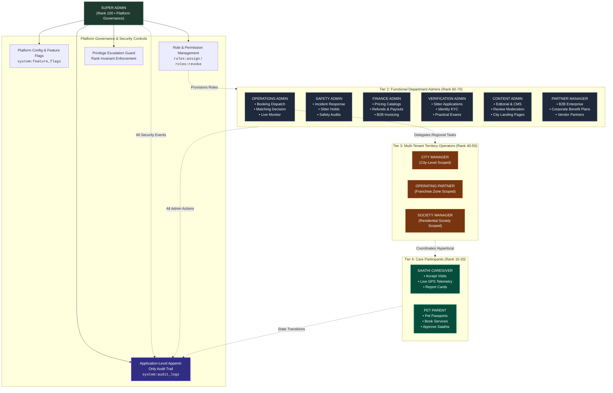
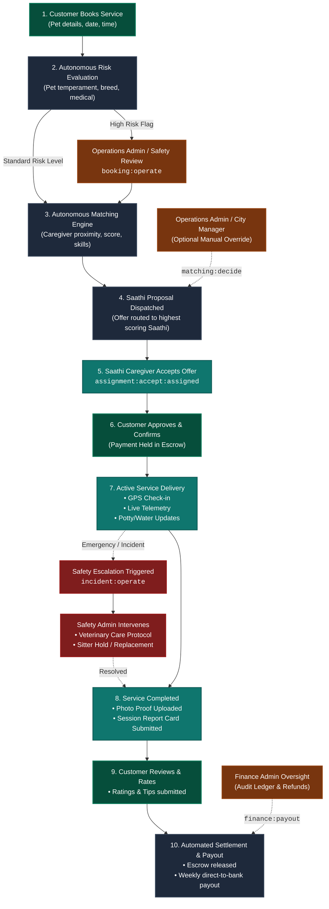

# PetSaathi Platform: Role-Based Access Control (RBAC) Architecture

## 1. Executive Summary & Architectural Paradigm

PetSaathi enforces a multi-tiered, capability-driven **Role-Based Access Control (RBAC)** architecture designed around three core tenets:

1. **Separation of Governance & Operations**:
   `SUPER_ADMIN` acts strictly as a **governance and security authority**. The Super Admin configures roles, inspects audit trails, toggles feature gates, and manages global infrastructure. **Super Admin is NEVER an operational gatekeeper in the daily pet care lifecycle** (e.g., booking a walk, accepting an assignment, or delivering a report card). The operational loop runs autonomously through customers, sitters, and departmental administrators.
2. **Explicit Distinction: Role $\ne$ Permission**:
   A **Role** is a convenient grouping of capabilities assigned to a user identity. A **Permission** is an atomic, resource-level capability (e.g. `booking:dispatch`, `finance:refund`, `pet:write:own`). The system authorizes actions based on *effective permissions*, not raw role strings.
3. **Multi-Tenancy & Least Privilege**:
   Access to resources is bounded by ownership (`:own`), territory scopes (City / Service Zone), and organization memberships. Privilege escalation is prevented at the database and application layers.

---

## 2. Diagram 1: Administrative Governance & RBAC Hierarchy

This diagram details the top-down administrative governance, permission distribution, and privilege boundaries.



---

## 3. Diagram 2: Operational Care Workflow

This diagram maps the autonomous operational lifecycle of a pet care service, showing where departmental admins provide operational oversight without requiring Super Admin intervention.



---

## 4. Multi-Tenancy & Data Isolation Boundaries

### 4.1 Territory Scoping (`resolveTerritoryScope`)
For regional roles (`OPERATOR`, `CITY_MANAGER`, `SOCIETY_MANAGER`), database queries are strictly filtered using territory scope resolvers:
- **`CITY_MANAGER`**: Constrained to city IDs explicitly assigned in the `CityManager` relation table.
- **`OPERATOR`**: Constrained to service zones and city boundaries tied to their active `OperatingPartner` contract.
- **`SUPER_ADMIN` & `OPERATIONS_ADMIN`**: Have `unrestricted: true`, allowing cross-city visibility.

### 4.2 Resource Ownership & IDOR Protection
Permissions suffixed with `:own` (such as `pet:read:own`, `pet:write:own`, `medical:write:own`, `booking:cancel:own`) enforce caller-resource identity checks:
```typescript
if (scope?.ownerId && permission.endsWith(":own")) {
  if (identity.id !== scope.ownerId) {
    return false; // Denied: Caller does not own this resource
  }
}
```

---

## 5. Privilege Escalation Safeguards

PetSaathi implements four strict guardrails against privilege escalation:

1. **Hierarchy Rank Invariant (`ROLE_HIERARCHY_RANK`)**:
   A user can only assign or revoke roles that are strictly lower in rank than their own highest held role.
   - `SUPER_ADMIN` (Rank 100) is the **only role** capable of granting or revoking `SUPER_ADMIN`.
   - `OPERATIONS_ADMIN` (Rank 70) cannot grant `OPERATIONS_ADMIN`, `SAFETY_ADMIN`, or `SUPER_ADMIN`.
2. **Dedicated Role Management Permissions**:
   Role modification requires `roles:assign` or `roles:revoke`. General operational admins cannot alter user security profiles.
3. **Application-Level Append-Only Audit Logging**:
   Every role grant, role revocation, and custom permission assignment writes an append-only log record into `audit_logs` containing `actorId`, `actorRole`, `action`, `before`, `after`, `reason`, and `requestId`.
4. **Custom Permission Gate**:
   Explicit user-level overrides via `AdminPermission` records can only be provisioned by a `SUPER_ADMIN` with a documented business reason and optional expiration date.

---

## 6. Server-Side Enforcement Architecture

All authorization is centralized in `src/modules/rbac/`:

- **`permissions.ts`**: Canonical list of 12 roles, 50+ granular permissions, rank hierarchies, and role-to-permission mappings.
- **`authorize.ts`**: Core runtime authorization engine:
  - `resolveUserPermissions(userId, roles)`: Resolves active role capabilities + database `AdminPermission` grants.
  - `canUser(identity, permission, scope)`: Validates capabilities, IDOR ownership, and territory scoping.
  - `authorizePermission(permission, scope)`: API route middleware returning typed authorization or 401/403 responses.
  - `assignUserRole(...)` / `revokeUserRole(...)`: Safe role mutations with rank checks and audit logging.
- **`audit-logger.ts`**: Centralized, structured audit writer and query engine for `prisma.auditLog`.
- **`admin-access.ts`**: Route-level edge authorization matching paths to authorized role subsets.
- **`territory-scope.ts`**: Prisma where-clause generator for multi-tenant territory filtering.
