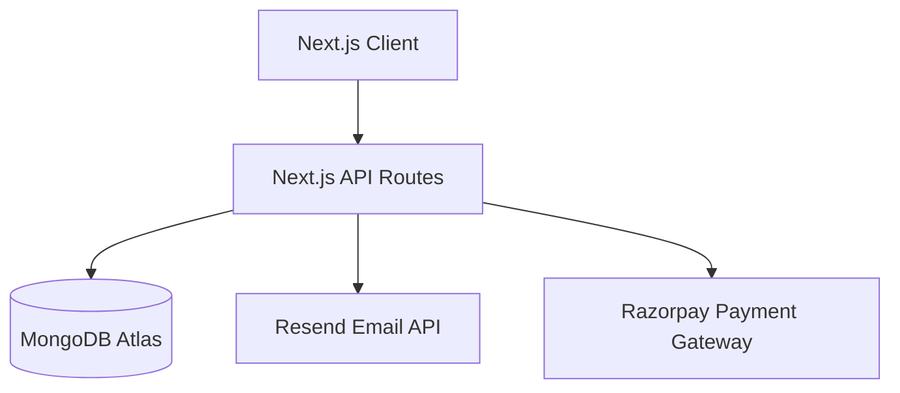

# PetSaathi Architecture

## System Diagram

## Tech Stack Decisions
- **Framework**: Next.js 15 App Router for SSR, SEO, and fast routing.
- **Database**: MongoDB Atlas with Prisma ORM for type-safe queries.
- **Styling**: Tailwind CSS for rapid UI development.
- **State/Data**: React Server Components and Server Actions.
- **Payments**: Razorpay for India-specific payment orchestration.
- **Observability**: Sentry for error tracking and tracing.

## Data Flow
- Clients fetch data via React Server Components.
- Mutations are handled by POST/PUT API routes.
- Webhooks from Razorpay update Booking and Payment states asynchronously.
