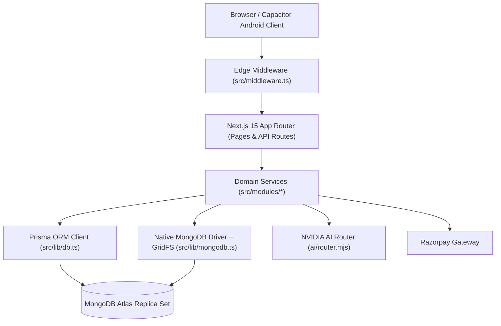

# PetSaathi Architecture Overview

> For the complete 26-section canonical architecture, 12-role RBAC matrix, state machines, service catalog, and operational reference, see **[`docs/PETSAATHI_ARCHITECTURE_AND_OPERATIONS.md`](./PETSAATHI_ARCHITECTURE_AND_OPERATIONS.md)**.

## System Diagram

```mermaid
flowchart TD
    Client["Browser / Capacitor Android Client"] --> MW["Edge Middleware (src/middleware.ts)"]
    MW --> AppRouter["Next.js 15 App Router (Pages & API Routes)"]
    AppRouter --> Domain["Domain Services (src/modules/*)"]
    Domain --> Prisma["Prisma ORM Client (src/lib/db.ts)"]
    Domain --> NativeMongo["Native MongoDB Driver + GridFS (src/lib/mongodb.ts)"]
    Domain --> AIRouter["NVIDIA AI Router (ai/router.mjs)"]
    Domain --> Razorpay["Razorpay Gateway"]
    Prisma --> Atlas[("MongoDB Atlas Replica Set")]
    NativeMongo --> Atlas
```

## Core Architecture Principles
- **Framework**: Next.js 15 App Router (`15.5.14`) with React 19 (`19.0.0`) and TypeScript (`^5.7.3`).
- **Dual Database Access Layer**:
  - **Prisma ORM (`6.19.3`)**: Relational domain models, transactional state machines, RBAC, bookings, payments, and audit logs (`prisma/schema.prisma`).
  - **Native MongoDB Driver (`^6.16.0`)**: Low-level authentication collections (`auth_credentials`, `auth_challenges`, `auth_sessions`, `oauth_states`), TTL indexes, and GridFS quarantine/media storage (`src/lib/mongodb.ts`, `src/modules/storage/gridfs.ts`).
- **12-Role RBAC**: Strictly enforced across Edge middleware, server layouts, and API route handlers (`src/modules/rbac/permissions.ts`, `src/modules/rbac/authorize.ts`, `src/modules/auth/admin-access.ts`) with fail-closed audit logging (`src/modules/rbac/audit-logger.ts`).
- **Payments**: Razorpay order creation and raw-body HMAC-SHA256 webhook reconciliation with distributed lease locking (`src/app/api/webhooks/razorpay/route.ts`).
- **AI Routing**: Capability-based model selection via `ai/router.mjs` and `ai/models.mjs`.
