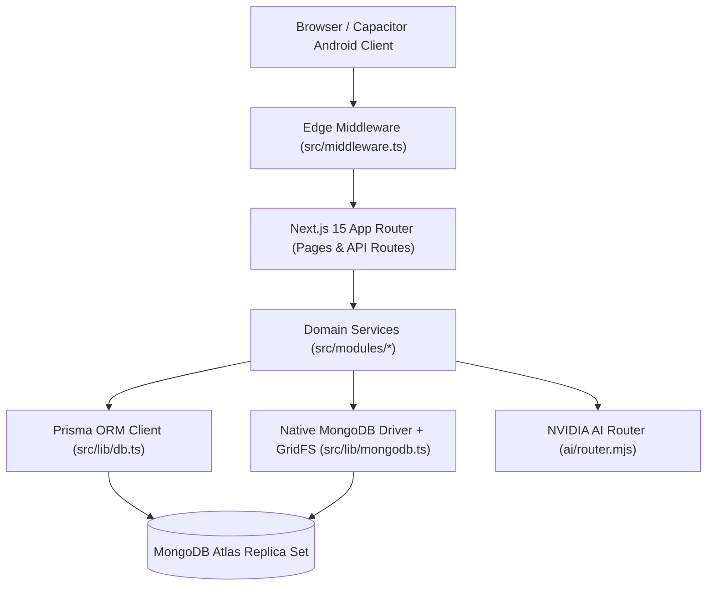
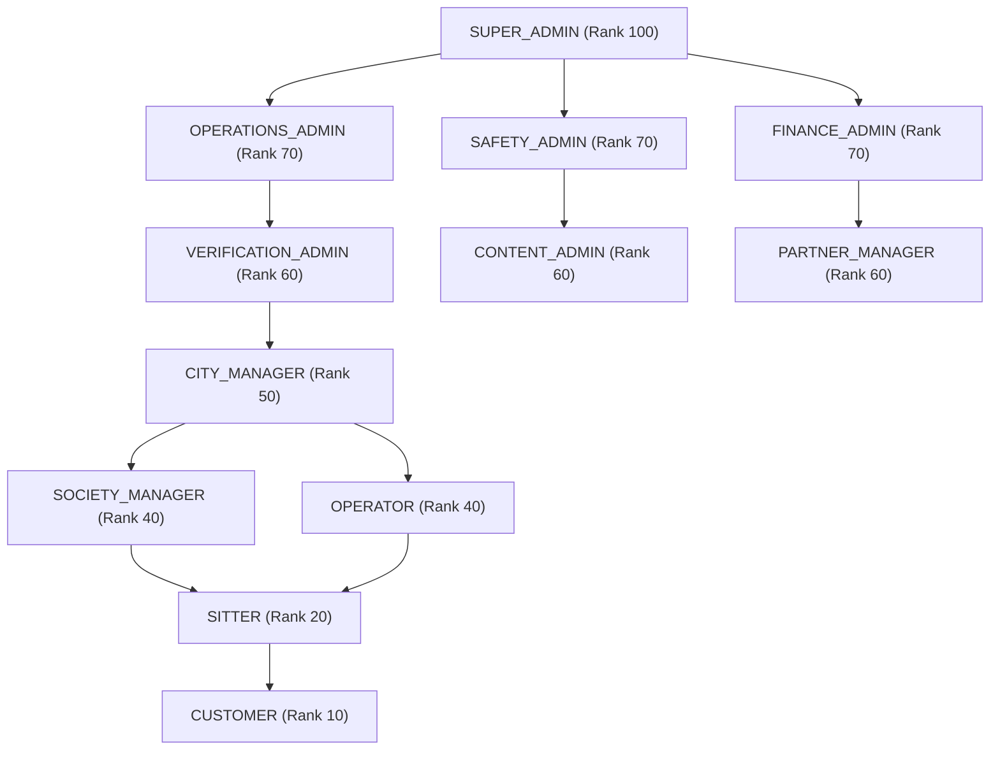
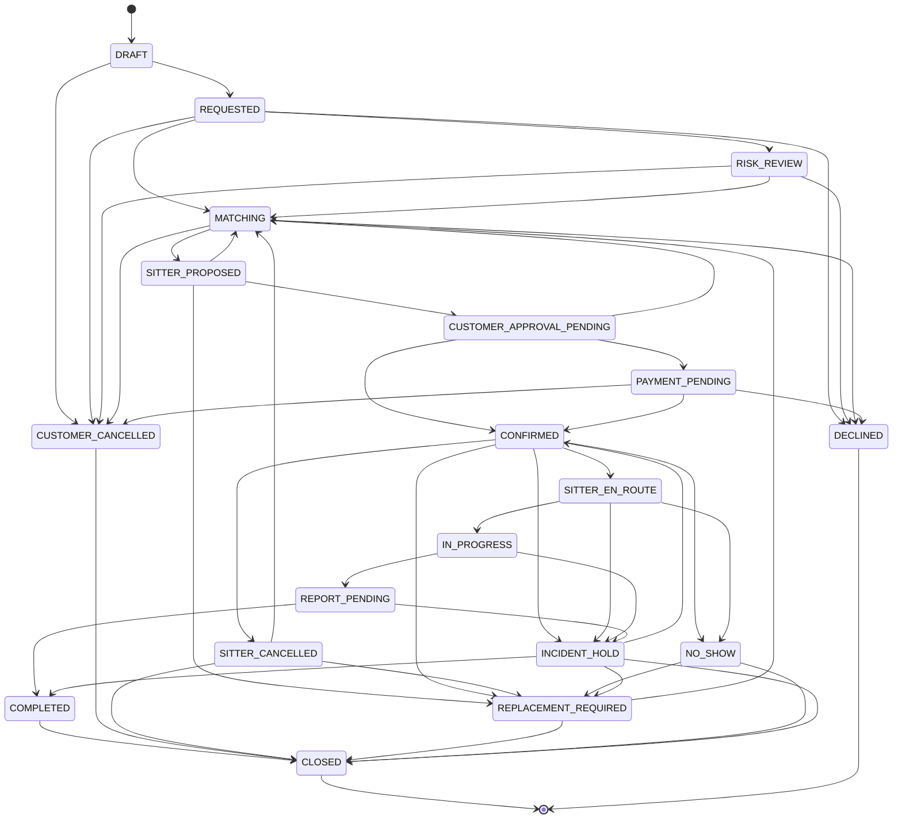
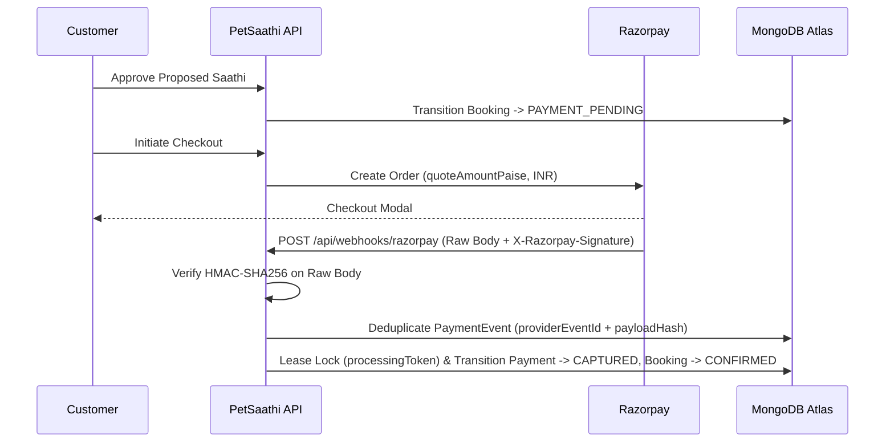
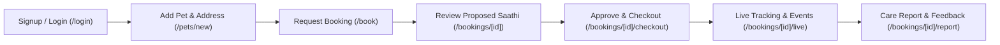
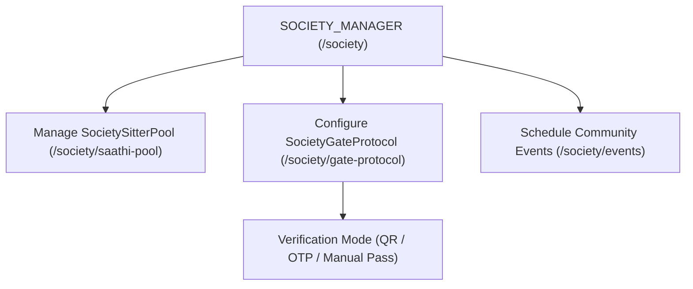

# PetSaathi — Canonical Architecture, RBAC & Operations Reference

> **Classification:** Official Source-of-Truth Architecture & Operations Document  
> **Repository:** `C:\Users\Prince\Downloads\PetSaathi`  
> **Verification Standard:** Strict code-backed and runtime-verified classification  

### Evidence Classification Legend
- `[VERIFIED CODE]` — Directly implemented and verified in repository source files and automated unit/invariant tests.
- `[VERIFIED RUNTIME]` — Executed and verified against live runtime/database infrastructure.
- `[CONFIGURED BUT DISABLED]` — Code and route handlers exist with fail-safe guards, but external provider/UI exposure is disabled in the current release.
- `[BUSINESS POLICY]` — Operational or legal policy rule governed by human workflow rather than automated external settlement.
- `[UNVERIFIED EXTERNAL]` — External daemon, container, or third-party sandbox not verified in live production runtime.

---

## 1. Executive Overview

PetSaathi is a trust-first pet-care operations platform built for Indian urban neighborhoods and residential societies (`[VERIFIED CODE]`). Unlike unmoderated listing directories, PetSaathi enforces a structured, multi-stage care protocol: every booking progresses through assisted caregiver matching, customer approval, server-side quote locking, verified payment or entitlement redemption, GPS-gated check-in, structured care reporting, and immutable audit logging (`[VERIFIED CODE]`).

---

## 2. Current Architecture

PetSaathi uses a unified Next.js 15 App Router monolith backed by both **Prisma ORM** (for relational domain models, transactions, and state machines) and the **native MongoDB Node.js driver** (for low-level authentication collections `auth_credentials`, `auth_challenges`, `auth_sessions`, `oauth_states`, and GridFS quarantine/media storage) (`[VERIFIED CODE]`).



---

## 3. Current Technical Stack

Extracted directly from root `package.json` and lockfile (`[VERIFIED CODE]`):

| Layer | Technology | Version | Usage |
|---|---|---|---|
| **Runtime** | Node.js | `>=20.18.0` (v22.23.2 active) | Server execution runtime |
| **Framework** | Next.js | `15.5.14` | App Router, SSR, API routes, Edge middleware |
| **UI Library** | React / React DOM | `19.0.0` | Component rendering |
| **Language** | TypeScript | `^5.7.3` | Static type system (`tsc --noEmit`) |
| **Styling** | Tailwind CSS | `^3.4.17` | Design tokens and responsive layout |
| **ORM** | Prisma / `@prisma/client` | `6.19.3` | Domain schema (`prisma/schema.prisma`) & transactions |
| **Database Driver** | `mongodb` (Native Driver) | `^6.16.0` | Auth collections, TTL indexes, GridFS buckets |
| **Authentication** | `next-auth` + Native Mongo Auth | `^4.24.13` | JWT credentials + `petsaathi_session` cookie |
| **Payments** | `razorpay` | `^2.9.6` | Order creation, HMAC webhook & checkout verification |
| **Email** | `nodemailer` + Resend HTTP API | `^8.0.4` | Transactional email & OTP outbox delivery |
| **Error Tracking** | `@sentry/nextjs` | `^10.46.0` | Server/client observability (graceful no-op when DSN unset) |
| **Testing** | Vitest + Playwright | `^3.0.5` / `^1.51.0` | Unit, concurrency, and browser E2E suites |
| **Mobile Wrapper** | Capacitor (`@capacitor/*`) | `^8.5.0` | Android hybrid shell |
| **Maps** | `leaflet` | `^1.9.4` | Service area & tracking visualization |
| **Motion** | `framer-motion` + `gsap` | `^12.4.7` / `^3.14.2` | UI transitions |
| **AI Routing** | OpenAI SDK via `ai/router.mjs` | `^6.33.0` | Capability-routed NVIDIA AI integration |

> **Nested Application Separation Note:** Any secondary or archived workspace folder (such as `petsaathi-web/` if present in local environments) is strictly separate from the root application (`C:\Users\Prince\Downloads\PetSaathi`) and is never mixed into root build, test, or dependency metrics (`[VERIFIED CODE]`).

---

## 4. Authentication Mechanisms

PetSaathi implements **multi-mechanism authentication** (`src/modules/auth/mongodb-auth.ts`, `src/lib/auth.ts`, `src/modules/auth/oauth-state.ts`). This is **not** mandatory multi-factor authentication (MFA); rather, users authenticate through one of the supported mechanisms (`[VERIFIED CODE]`):

1. **Password Authentication (`scrypt` / `bcrypt`):**
   - Stored in native MongoDB collection `auth_credentials` (`[VERIFIED CODE]`).
   - Supports customer/sitter password login (`/api/auth/password/signin`) and dedicated admin sign-in (`/api/auth/admin/signin`).
   - Admin accounts (`SUPER_ADMIN` and admin portal roles) can **only** authenticate via password — never via Google OAuth (`[VERIFIED CODE]`).
2. **Email / Phone OTP Challenge:**
   - Stored in `auth_challenges` with HMAC-SHA256 hashed codes (`challengeHash`), 10-minute TTL (`CHALLENGE_MINUTES = 10`), and a strict 6-attempt limit (`MAX_CHALLENGE_ATTEMPTS = 6`) (`[VERIFIED CODE]`).
   - Fixed development OTP (`AUTH_DEV_FIXED_OTP`) is strictly rejected in production by `src/lib/env.ts` (`[VERIFIED CODE]`).
3. **Native Session Cookies & NextAuth JWT:**
   - Native auth issues an `httpOnly`, `sameSite: lax`, `secure` (in production) session cookie named `petsaathi_session` backed by `auth_sessions` (`[VERIFIED CODE]`).
   - NextAuth (`src/lib/auth.ts`) issues signed JWT cookies (`__Secure-next-auth.session-token` in production) using the shared secret from `src/lib/auth-secret.ts` (`[VERIFIED CODE]`).
4. **Google OAuth & One-Tap (`[VERIFIED CODE]` / `[CONFIGURED BUT DISABLED]` if client ID unset):**
   - Redirect flow: `/api/auth/google/oauth` → Google consent → `/api/auth/google/callback` (`[VERIFIED CODE]`).
   - Uses HMAC-signed state tokens (`src/modules/auth/oauth-state.ts`) bound to an `httpOnly` cookie nonce (`google_oauth_nonce`) with open-redirect sanitization (`sanitizeReturnUrl`) (`[VERIFIED CODE]`).
   - Google buttons render on `/login` only when `hasUsableGoogleClientId(process.env.NEXT_PUBLIC_GOOGLE_CLIENT_ID)` evaluates to true (`src/lib/public-config.ts`) (`[VERIFIED CODE]`).
5. **Account Status Enforcement:**
   - Users with status `SUSPENDED`, `DISABLED`, `DEACTIVATED`, or `BLOCKED` are rejected across all login and session resolution paths (`checkAccountStatusAllowed` in `src/modules/auth/mongodb-auth.ts`) (`[VERIFIED CODE]`).

---

## 5. 12-Role RBAC Model

Verified directly from `prisma/schema.prisma` (`enum Role`) and `src/modules/rbac/permissions.ts` (`[VERIFIED CODE]`). Exactly **12 platform roles** exist:

1. `CUSTOMER`
2. `SITTER`
3. `OPERATIONS_ADMIN`
4. `VERIFICATION_ADMIN`
5. `SAFETY_ADMIN`
6. `FINANCE_ADMIN`
7. `CONTENT_ADMIN`
8. `SOCIETY_MANAGER`
9. `PARTNER_MANAGER`
10. `CITY_MANAGER`
11. `OPERATOR`
12. `SUPER_ADMIN`

> Domain concepts such as `VET_SUPPORT`, `TRAINING_ASSESSMENT`, `VET_CLINIC`, and `TRAINING_CHAIN` are service/partner domain enums, **never** user RBAC roles (`[VERIFIED CODE]`).

---

## 6. Role Ranks (Anti-Escalation Boundary)

Verified from `ROLE_HIERARCHY_RANK` in `src/modules/rbac/permissions.ts` (`[VERIFIED CODE]`):



**Critical Architectural Rule:** `ROLE_HIERARCHY_RANK` is strictly a **role-management / anti-escalation boundary** (`canActorManageRole`), **not** automatic permission inheritance. Higher rank never automatically grants a lower role's domain permissions (`[VERIFIED CODE]`).

---

## 7. Exact Permission Mapping

Extracted directly from `rolePermissions` in `src/modules/rbac/permissions.ts` (`[VERIFIED CODE]`):

| Role | Rank | Declared Permissions |
|---|---:|---|
| `CUSTOMER` | 10 | `users:read:own`, `users:write:own`, `pet:read:own`, `pet:write:own`, `medical:read:own`, `medical:write:own`, `booking:read:own`, `booking:create`, `booking:cancel:own` |
| `SITTER` | 20 | `users:read:own`, `users:write:own`, `assignment:read:assigned`, `assignment:accept:assigned`, `service:update:assigned` |
| `OPERATOR` | 40 | `booking:operate`, `operator:read` |
| `SOCIETY_MANAGER` | 40 | `society:read`, `society:operate`, `booking:operate` |
| `CITY_MANAGER` | 50 | `users:read:any`, `booking:operate`, `matching:decide`, `operator:read`, `operator:operate` |
| `PARTNER_MANAGER` | 60 | `users:read:any`, `b2b:read`, `b2b:operate`, `partner:operate`, `operator:read` |
| `VERIFICATION_ADMIN` | 60 | `users:read:any`, `verification:read`, `verification:decide` |
| `CONTENT_ADMIN` | 60 | `content:read`, `content:write`, `content:publish`, `content:operate` |
| `FINANCE_ADMIN` | 70 | `users:read:any`, `finance:read`, `finance:operate`, `finance:refund`, `finance:payout`, `b2b:invoicing` |
| `SAFETY_ADMIN` | 70 | `users:read:any`, `pet:read:any`, `medical:read:any`, `incident:read`, `incident:operate`, `incident:override`, `safety:hold_manage`, `verification:read` |
| `OPERATIONS_ADMIN` | 70 | `users:read:any`, `pet:read:any`, `booking:operate`, `booking:dispatch`, `booking:override`, `matching:decide`, `matching:override`, `verification:read`, `incident:read`, `operator:read`, `operator:operate` |
| `SUPER_ADMIN` | 100 | All 45 declared platform permissions (`permissions` array in `src/modules/rbac/permissions.ts`) |

---

## 8. Canonical Role Landings & Multi-Role Routing

Verified from `getDefaultDashboardForRoles` and `getPrimaryRole` in `src/modules/auth/admin-access.ts` (`[VERIFIED CODE]`):

| Role | Canonical Landing | Secondary / Allowed Routes |
|---|---|---|
| `SUPER_ADMIN` | `/admin` | All `/admin/*`, `/operator/*`, `/society/*` routes |
| `OPERATIONS_ADMIN` | `/admin` | `/admin/operations/*`, `/admin/matching`, `/admin/cities`, `/admin/leads`, `/admin/safety`, `/admin/reports`, `/admin/support`, `/admin/catalog`, `/admin/vaccination-camps` |
| `SAFETY_ADMIN` | `/admin/safety` | `/admin`, `/admin/operations/trust-safety`, `/admin/reports`, `/admin/support` |
| `FINANCE_ADMIN` | `/admin/finance` | `/admin`, `/admin/plans`, `/admin/b2b/invoices`, `/admin/reports/investor-metrics`, `/admin/catalog` |
| `VERIFICATION_ADMIN` | `/admin/verification` | `/admin` |
| `CONTENT_ADMIN` | `/admin/content` | `/admin`, `/admin/content/testimonials`, `/admin/testimonials` |
| `PARTNER_MANAGER` | `/admin/b2b` | `/admin`, `/admin/partners`, `/admin/partner-orders`, `/partners` (secondary portal) |
| `CITY_MANAGER` | `/admin/cities` | `/admin`, `/admin/operations/cities`, `/operator-portal/[city]` (secondary portal) |
| `OPERATOR` | `/operator` | `/operator/territories`, `/operator/city-health`, `/operator/economics` |
| `SOCIETY_MANAGER` | `/society` | `/society/residents`, `/society/saathi-pool`, `/society/gate-protocol`, `/society/events`, `/admin/operations/community` |
| `SITTER` | `/saathi` | `/saathi/inbox`, `/saathi/assignments`, `/saathi/availability`, `/saathi/earnings`, `/saathi/profile`, `/saathi/reports`, `/saathi/academy`, `/saathi/performance` |
| `CUSTOMER` | `/dashboard` | `/dashboard/history`, `/pets/*`, `/bookings/*`, `/customer/*`, `/settings/*`, `/support` |

**Multi-Role Deterministic Routing:** When a user holds multiple roles (e.g., `CUSTOMER` + `SITTER` or `SUPER_ADMIN` + `OPERATIONS_ADMIN`), `getPrimaryRole` and `getDefaultDashboardForRoles` evaluate a deterministic priority array (`SUPER_ADMIN` → `OPERATIONS_ADMIN` → `SAFETY_ADMIN` → `FINANCE_ADMIN` → `VERIFICATION_ADMIN` → `CONTENT_ADMIN` → `PARTNER_MANAGER` → `CITY_MANAGER` → `OPERATOR` → `SOCIETY_MANAGER` → `SITTER` → `CUSTOMER`), never relying on database array order `roles[0]` (`[VERIFIED CODE]`).

---

## 9. Role Assignment Policy

Verified from `src/app/api/admin/rbac/assign-role/route.ts` and `src/modules/rbac/authorize.ts` (`[VERIFIED CODE]`):

| Actor Role | Default `roles:assign` / `roles:revoke`? | Can Assign (Static Default) | Can Revoke (Static Default) | Rank Rule if Dynamic Override Granted |
|---|---|---|---|---|
| `SUPER_ADMIN` | **Yes** | All 12 roles | All roles (except last active `SUPER_ADMIN`) | Unrestricted (Rank 100) |
| `OPERATIONS_ADMIN` | **No** | None by default | None by default | Target rank `< 70` (no self-assignment) |
| `SAFETY_ADMIN` | **No** | None by default | None by default | Target rank `< 70` (no self-assignment) |
| `FINANCE_ADMIN` | **No** | None by default | None by default | Target rank `< 70` (no self-assignment) |
| `VERIFICATION_ADMIN` | **No** | None by default | None by default | Target rank `< 60` (no self-assignment) |
| `CONTENT_ADMIN` | **No** | None by default | None by default | Target rank `< 60` (no self-assignment) |
| `PARTNER_MANAGER` | **No** | None by default | None by default | Target rank `< 60` (no self-assignment) |
| `CITY_MANAGER` | **No** | None by default | None by default | Target rank `< 50` (no self-assignment) |
| `SOCIETY_MANAGER` | **No** | None by default | None by default | Target rank `< 40` (no self-assignment) |
| `OPERATOR` | **No** | None by default | None by default | Target rank `< 40` (no self-assignment) |
| `SITTER` | **No** | None | None | Target rank `< 20` |
| `CUSTOMER` | **No** | None | None | None (Rank 10 is minimum) |

---

## 10. Booking State Machine

Verified from `src/modules/bookings/state-machine.ts` (`[VERIFIED CODE]`).



**Entitlement Booking Invariant:** When a customer has an `ACTIVE` subscription with positive entitlement balance (`src/modules/bookings/create-booking.ts`), an atomic compare-and-swap lock (`tx.subscription.updateMany`) deducts 1 unit into `EntitlementLedger` and `EntitlementConsumption`, **but** the booking status is still initialized to `REQUESTED`. It never skips caregiver matching or customer approval (`[VERIFIED CODE]`).

---

## 11. Matching Flow

Verified from `src/modules/matching/service.ts` and `src/modules/matching/offer-assignment.ts` (`[VERIFIED CODE]`):
1. Candidate sitters must have `user.status === "ACTIVE"`, `SitterProfile.status === "APPROVED"`, active `ServicePermission` for the requested `ServiceCode`, an active `SitterServiceArea` covering the booking's `serviceAreaId`, and an available `AvailabilitySlot` covering the scheduled window without conflicting active assignments.
2. Candidates are scored deterministically (locality match, experience, completion rate, verification completeness) or via optional `FASTAPI_URL` scorer with automatic deterministic fallback (`[VERIFIED CODE]`).
3. Offering a sitter creates a `BookingAssignment` (`status: "OFFERED"`) and transitions the booking to `SITTER_PROPOSED` (`[VERIFIED CODE]`).
4. When the sitter accepts (`ACCEPTED`), the booking transitions to `CUSTOMER_APPROVAL_PENDING`. Only one active primary/replacement assignment can exist per booking (enforced by partial unique index `booking_assignments_one_active_per_booking` and transactional checks) (`[VERIFIED CODE]`).

---

## 12. Payment, Refund & Webhook Flow

Verified from `src/modules/payments/razorpay.ts`, `src/app/api/webhooks/razorpay/route.ts`, `src/modules/payments/refunds.ts`, and `src/modules/payments/provider-deadline.ts` (`[VERIFIED CODE]`):



- **Raw Payload Signature Verification:** `/api/webhooks/razorpay` reads `await request.text()` and validates `x-razorpay-signature` using constant-time HMAC-SHA256 before parsing JSON (`[VERIFIED CODE]`).
- **Replay & Concurrency Protection:** Deduplicates by `providerEventId`, verifies `payloadHash` (409 on payload tampering), and fences concurrent workers with a 120-second `processingToken` lease inside a MongoDB transaction (`[VERIFIED CODE]`).
- **Refund Workflow:** Refunds follow `REQUESTED -> APPROVED -> INITIATED -> PROCESSED` (or `FAILED` / `REJECTED`) (`src/modules/payments/refunds.ts`) (`[VERIFIED CODE]`).
- **Payout Workflow:** Completed care reports generate a `Payout` ledger entry (`PENDING -> APPROVED -> PROCESSING -> PAID`) calculated from the immutable price quote's `sitterPaise`. PetSaathi maintains the weekly payout workflow and ledger; external bank settlement is executed through the configured banking/payment provider (`[VERIFIED CODE]`, `[BUSINESS POLICY]`).

---

## 13. Customer Journey



- **Customer Signup Lifecycle (`src/modules/auth/mongodb-auth.ts`):** Password signup (`/api/auth/password/signup`) or OTP verification creates a `User` with `status: AccountStatus.ACTIVE`, assigns the `CUSTOMER` role in `UserRole`, stores credentials in `auth_credentials`, and issues an authenticated session cookie (`[VERIFIED CODE]`).

---

## 14. Saathi (Caregiver) Journey

```mermaid
flowchart LR
    Apply["Apply (/become-a-saathi)"] --> Onboard["SitterProfile (APPLIED / IN_VERIFICATION)"]
    Onboard --> Verify["Verification Admin Review (/admin/verification)"]
    Verify --> Approve["Status: APPROVED + ServicePermission"]
    Approve --> Avail["Set Availability (/saathi/availability)"]
    Avail --> Offer["Accept Offer (/saathi/inbox)"]
    Offer --> Deliver["Check-in, GPS & Care Report (/saathi/assignments)"]
    Deliver --> Earn["Payout Ledger (/saathi/earnings)"]
```



- **Sitter Role Assignment Lifecycle:** Applying via `/become-a-saathi` (`POST /api/public/sitter-applications`) or choosing the `SITTER` tab during sign-in/signup assigns the `SITTER` role and creates a `SitterProfile` in `ONBOARDING` / `APPLIED` status (`[VERIFIED CODE]`). However, a `SITTER` role alone **never** makes a caregiver eligible for matching: matching requires `SitterProfile.status === "APPROVED"`, active `ServicePermission` records, and verified `SitterVerification` checks approved by a `VERIFICATION_ADMIN` or `SUPER_ADMIN` (`[VERIFIED CODE]`).

---

## 15. Society Workflow & Gate Protocols

Verified from `prisma/schema.prisma`, `src/app/(portal)/society/page.tsx`, `src/app/api/admin/societies`, and `src/app/api/b2b/societies` (`[VERIFIED CODE]`):



- **Society Sitter Pool:** Societies can curate a preferred `SocietySitterPool` (`ACTIVE`, `PAUSED`, `REMOVED`). In matching (`src/modules/matching/service.ts`), society pool membership is a **preferred/optional capability**, not a universal hard blocker for all city bookings unless scoped to a society program (`[VERIFIED CODE]`).
- **Gate Entry Protocol:** `SocietyGateProtocol` stores the society's gate verification mode and rules (`src/app/(portal)/society/gate-protocol/page.tsx`). Dynamic third-party MyGate hardware synchronization is `[CONFIGURED BUT DISABLED]` unless `MYGATE_API_KEY` is provisioned (`[VERIFIED CODE]`).

---

## 16. Service Catalog

Extracted directly from `prisma/schema.prisma` (`enum ServiceCode`), `prisma/seed.mjs`, and `src/modules/catalog/services.ts` (`[VERIFIED CODE]`):

| ServiceCode | Display Name | Catalog Status | Seeded `active`? | Duration (mins) | Requires Manual Match? | Requires Property? | Source |
|---|---|---|---|---:|---|---|---|
| `DOG_WALK_30` | 30-minute dog walk | `ACTIVE` | `true` | 30 | `true` | `false` | `prisma/seed.mjs` |
| `DOG_WALK_60` | 60-minute dog walk | `ACTIVE` | `true` | 60 | `true` | `false` | `prisma/seed.mjs` |
| `HOME_VISIT` | Home visit | `ACTIVE` | `true` | 45 | `true` | `false` | `prisma/seed.mjs` |
| `HOME_SITTING_60` | 60-minute home sitting | `ACTIVE` | `true` | 60 | `true` | `false` | `prisma/seed.mjs` |
| `TRAVEL_SITTING` | Travel sitting | `DISABLED` | `false` | 720 | `true` | `true` | `prisma/seed.mjs` |
| `BOARDING_BETA` | Boarding beta | `BETA` (Controlled Pilot) | `false` (Pilot gated) | 720 | `true` | `true` | `prisma/seed.mjs` |
| `GROOMING_HOME` | At-home grooming | `DISABLED` (Request-only) | `false` (Partner gated) | 90 | `true` | `false` | `prisma/seed.mjs` |
| `VET_SUPPORT` | Veterinary support | `DISABLED` (Request-only) | `false` (Partner gated) | 60 | `true` | `false` | `prisma/seed.mjs` |
| `TRAINING_ASSESSMENT` | Training assessment | `DISABLED` (Request-only) | `false` (Partner gated) | 60 | `true` | `false` | `prisma/seed.mjs` |
| `PET_TAXI` | Pet taxi | `DISABLED` (Request-only) | `false` (Partner gated) | 60 | `true` | `false` | `prisma/seed.mjs` |

---

## 17. Safety Workflow & Business Claims Governance

Verified from `src/app/(portal)/admin/safety/page.tsx`, `src/modules/incidents/state-machine.ts`, `src/modules/incidents/workflow.ts`, and public marketing tests (`tests/e2e/marketing.spec.ts`) (`[VERIFIED CODE]`):

- **Incident & Safety Hold Management:** `SAFETY_ADMIN`, `OPERATIONS_ADMIN`, and `SUPER_ADMIN` can triage `Incident` records (`REPORTED -> TRIAGING -> ACTIVE_RESPONSE -> VET_CONTACTED -> TRANSPORTING -> MONITORING -> IMMEDIATE_RISK_RESOLVED -> REVIEW_PENDING -> CORRECTIVE_ACTION_OPEN -> CLOSED`), place bookings on `INCIDENT_HOLD`, manage `SafetyHold` records on sitters, and trigger replacement workflows (`REPLACEMENT_REQUIRED`) (`[VERIFIED CODE]`).
- **Veterinary Assistance Claim Governance:** PetSaathi does **not** advertise an unsupported "₹50,000 emergency veterinary insurance guarantee" in its canonical architecture or public homepage copy (`tests/e2e/marketing.spec.ts` explicitly asserts no fabricated guarantees). Veterinary coordination (`VET_SUPPORT`) is non-emergency coordination; urgent clinical emergencies are routed directly to the nearest veterinary clinic (`[VERIFIED CODE]`).
- **Support Hours Governance:** Public copy and operational docs describe **operations escalation and structured support workflows** (`/support`, `/admin/support`) rather than claiming "24/7 human supervisor staffing" (`[VERIFIED CODE]`).

---

## 18. Notifications & External Integrations

| Integration | Status Label | Implementation Path | Notes |
|---|---|---|---|
| **Razorpay** | `[VERIFIED CODE]` / `[VERIFIED RUNTIME]` (Test Mode) | `src/modules/payments/razorpay.ts`, `src/app/api/webhooks/razorpay/route.ts` | Configured with `rzp_test_*` keys; raw body HMAC webhook & idempotency verified |
| **Google OAuth** | `[VERIFIED CODE]` | `src/app/api/auth/google/oauth/route.ts`, `src/app/api/auth/google/callback/route.ts` | Client ID & Secret configured; HMAC state + cookie nonce verified |
| **Email (Resend / Nodemailer)** | `[VERIFIED CODE]` | `src/modules/notifications/providers.ts`, `src/modules/auth/mongodb-auth.ts` | Transactional outbox & OTP email delivery implemented; live delivery depends on SMTP/Resend credentials |
| **WhatsApp / OpenWA** | `[CONFIGURED BUT DISABLED]` / `[UNVERIFIED EXTERNAL]` | `src/modules/notifications/providers.ts`, `src/app/api/webhooks/whatsapp/openwa/route.ts` | Code & webhook unit-tested (`tests/unit/openwa.test.ts`); local OpenWA daemon (`localhost:2785`) not running in serverless production |
| **DigiLocker KYC** | `[CONFIGURED BUT DISABLED]` | `src/modules/auth/kyc-state.ts`, `src/app/api/kyc/digilocker/route.ts` | Returns HTTP 503 (`digilocker_not_configured`) when credentials unset; not exposed in UI |
| **ClamAV Scanner** | `[CONFIGURED BUT DISABLED]` | `src/modules/security/scanner-adapter.ts`, `src/app/api/webhooks/scanner/route.ts` | Daemon not provisioned on Vercel; uploads remain quarantined in GridFS (`ManualScannerAdapter` fail-closed) |
| **NVIDIA AI Router** | `[VERIFIED CODE]` | `ai/router.mjs`, `ai/models.mjs` | Capability-routed LLM integration with circuit-breaker & fallback constraints |
| **FastAPI Scorer** | `[CONFIGURED BUT DISABLED]` | `src/modules/matching/service.ts` | Optional external ML scorer; automatically falls back to deterministic TypeScript scoring when `FASTAPI_URL` is unset |
| **Sentry** | `[VERIFIED CODE]` | `src/sentry.server.config.ts`, `src/instrumentation-client.ts` | Gracefully disabled when `SENTRY_DSN` is unset (`tests/unit/sentry-config.test.ts`) |

---

## 19. Storage & Malware Scanner Model

Verified from `src/modules/storage/gridfs.ts`, `src/modules/security/scanner-adapter.ts`, and `src/app/api/webhooks/scanner/route.ts` (`[VERIFIED CODE]`):
- All file uploads are initially written to the isolated MongoDB GridFS bucket `upload-quarantine` with `UploadObject.status = "QUARANTINED"`.
- Files are **never** promoted to destination buckets (`pet-media`, `identity-evidence`, `care-reports`, `incident-evidence`) unless an authenticated scanner callback (`SCANNER_CALLBACK_SECRET`) reports an explicit `"CLEAN"` verdict with matching SHA-256 hash, byte size, and magic-byte MIME signature (`[VERIFIED CODE]`).
- When `CLAMAV_HOST` is not configured in production, `getScannerAdapter()` returns `ManualScannerAdapter`, keeping files in quarantine (`status: "ERROR"`, fail-closed) until administrative review (`[VERIFIED CODE]`).

---

## 20. Database & Index Architecture

Verified live against MongoDB Atlas (`[VERIFIED RUNTIME]`):
- **Global Booking Idempotency Invariant (Model A):**
  - `Booking.idempotencyKey` (`@map("idempotency_key")`) is globally unique across the `bookings` collection.
  - Verified live Atlas index: `bookings_idempotency_key_key` with key `{ idempotency_key: 1 }`, `unique: true`, and `partialFilterExpression: { idempotency_key: { $type: "string" } }`.
  - Production duplicate check (`node scripts/verify-booking-indexes.mjs`): `duplicateGroups: 0`.
  - Cross-customer key collision throws HTTP 409 `BookingGateError("Idempotency key collision across customers")` (`src/modules/bookings/create-booking.ts`) and never leaks customer data (`[VERIFIED CODE]`, `[VERIFIED RUNTIME]`).
- **Additional Critical Partial Unique Indexes (`scripts/apply-mongodb-indexes.js`):**
  - `bookings_one_active_per_pet_slot`: `{ customer_id: 1, pet_id: 1, scheduled_start: 1 }` across active booking states.
  - `booking_assignments_one_active_per_booking`: `{ booking_id: 1 }` across active primary/replacement assignment states.

---

## 21. Observability & Health Endpoints

Verified in code and against live deployment `https://petsaathi-two.vercel.app` (`[VERIFIED RUNTIME]`):
- `GET /api/health` (`src/app/api/health/route.ts`): Pings MongoDB via `prisma.serviceType.findFirst`, returning HTTP 200 (`{"status":"ok","db":"connected"}`) with `Cache-Control: no-store, no-cache, must-revalidate`.
- `GET /api/ready` (`src/app/api/ready/route.ts`): Verifies database connectivity, auth secret configuration, and payment gateway readiness, returning HTTP 200 (`{"status":"ready","dependencies":{"database":"connected","auth":"configured","payments":"configured"}}`).
- Structured JSON logging (`src/lib/logger.ts`, `src/lib/observability/logger.ts`) with PII redaction (`[VERIFIED CODE]`).

---

## 22. Test Architecture & Developer Commands

Verified from `package.json` (`[VERIFIED CODE]`):

```powershell
# Static Analysis & Validation
npm run lint                # ESLint (--max-warnings=0)
npm run typecheck           # TypeScript compiler (tsc --noEmit)
npx prisma validate         # Validate Prisma schema

# Unit & Invariant Suite
npm test                    # Vitest unit suite (67 files, 302 tests)

# Production Build (includes Prisma generate, legal disclosure check, ESLint, tsc, Next build)
npm run build

# Local Development Server
npm run dev

# Safe Read-Only Production Index Verification
node scripts/verify-booking-indexes.mjs

# Local / Test Database Seeding ONLY (refuses production or non-local DBs)
# Requires ALLOW_TEST_SEED=true and TEST_SEED_PASSWORD (min 12 chars)
$env:ALLOW_TEST_SEED="true"; $env:TEST_SEED_PASSWORD="<strong-test-password>"; node scripts/seed-all-credentials.mjs
```

- **Disposable Database Safety Guards:** Integration (`npm run test:integration`) and concurrency (`npm run test:concurrency`) suites enforce `assertDisposableDatabase` (`localhost`/`127.0.0.1` + `petsaathi_test` or `petsaathi_ci` replica set) and refuse to run against production Atlas (`[VERIFIED CODE]`).

---

## 23. Deployment Process

Verified release workflow (`[VERIFIED CODE]`):
1. Pass all local static and unit checks (`npm run lint`, `npm run typecheck`, `npm test`, `npx prisma validate`, `npm run build`).
2. Commit verified changes and push to `origin/main` (`git push origin main`).
3. Verify `git rev-parse HEAD` matches `git ls-remote origin refs/heads/main` and the active Vercel production deployment SHA.
4. Execute post-deploy smoke checks against `/`, `/services`, `/login`, `/api/health`, and `/api/ready`.

---

## 24. Backup & Disaster Recovery

Documented in `docs/ops/BACKUP_RESTORE.md` (`[BUSINESS POLICY]`):
- **Policy:** MongoDB Atlas Continuous Cloud Backups (RPO < 1 hour, RTO < 30 minutes) with daily, weekly, and monthly snapshot retention tiers.
- **Verification Status:** Runbook procedures for point-in-time recovery (PITR) and collection-level restore are documented in `docs/ops/BACKUP_RESTORE.md`; a live staging cluster restore drill has **not** yet been executed in this session (`[UNVERIFIED EXTERNAL]`).

---

## 25. Known Disabled / Optional Integrations

1. **DigiLocker KYC (`[CONFIGURED BUT DISABLED]`):** Backend state and callback handlers exist (`src/app/api/kyc/digilocker/route.ts`, `src/app/api/kyc/digilocker/callback/route.ts`), returning 503 until government API credentials (`DIGILOCKER_CLIENT_ID`, `DIGILOCKER_CLIENT_SECRET`) are provisioned. Onboarding relies on human `VERIFICATION_ADMIN` review.
2. **ClamAV Daemon (`[CONFIGURED BUT DISABLED]`):** Serverless Vercel does not host a TCP `clamd` daemon; uploads stay isolated in GridFS `upload-quarantine` under `ManualScannerAdapter`.
3. **OpenWA WhatsApp Gateway (`[CONFIGURED BUT DISABLED]`):** Self-hosted OpenWA bot (`localhost:2785`) is optional and not active on serverless Vercel.
4. **MyGate Society Hardware Integration (`[CONFIGURED BUT DISABLED]`):** Gate protocols are stored in MongoDB; external MyGate API calls are disabled until society partner credentials are provided.

---

## 26. Release Status & Honest Operational Posture

- **Static & Unit Gate:** **PASS** (`npm run lint`, `npm run typecheck`, `npm test` — 67 files / 302 tests, `npx prisma validate`, `npm run build`).
- **Production Database Idempotency Index Gate:** **PASS** (`bookings_idempotency_key_key` verified live on Atlas with `duplicateGroups: 0`).
- **Live Production Health & Readiness Gate:** **PASS** (`https://petsaathi-two.vercel.app/api/health` and `/api/ready` both return HTTP 200).
- **Remaining Operational Verification Blockers (per Section 37 & 55 strict criteria):**
  1. Local Docker daemon (`dockerDesktopLinuxEngine`) is not running on this workstation, so the Docker-backed disposable replica-set integration (`npm run test:integration`) and concurrency (`npm run test:concurrency`) suites were not executed locally in this session.
  2. Live MongoDB Atlas staging restore drill (`docs/ops/BACKUP_RESTORE.md`) has not been executed against a separate staging cluster in this session.
  3. Full authenticated 12-role browser E2E against a disposable local test database requires the local disposable replica set.
